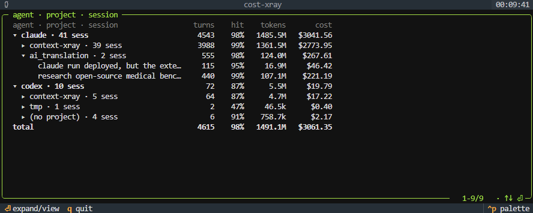
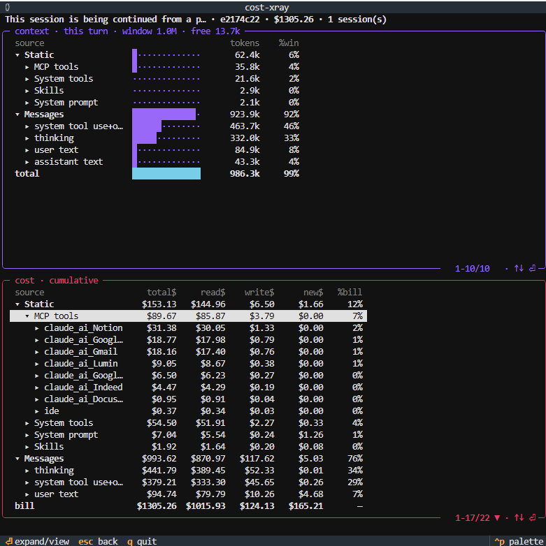

<h1 align="center">cost-xray</h1>

<p align="center"><strong>See where your AI coding tokens go — and what each one costs.</strong></p>

<p align="center">
  
  
  
  
  
</p>

cost-xray traces the token cost of every Claude Code and Codex request to its source: each tool schema, MCP server, message, and individual tool call, down to its output. Your usage logs show one total per call. cost-xray shows what inside the call spent it.

It reads the raw API request, not the logs. A local mitmproxy hop captures the exact bytes the model receives and prices every token by cache state — fresh, cache-read, or cache-write. Everything runs locally: 127.0.0.1 only, no telemetry, credentials redacted before disk.

<div align="center">
<table>
<tr><td align="center"><strong>Home</strong> — every session by agent · project · session, with token and dollar totals</td></tr>
<tr><td align="center"></td></tr>
<tr><td align="center"><strong>Drill a session</strong> — context-window occupancy (top) and per-source cost, down to each MCP server (bottom)</td></tr>
<tr><td align="center"></td></tr>
</table>
</div>

## Requirements

- A supported coding agent — [Claude Code](https://github.com/anthropics/claude-code) or [Codex](https://github.com/openai/codex)
- macOS or Linux
- No API keys, no account, no config changes to your agent — capture is a transparent local hop

## Install

```bash
curl -fsSL https://raw.githubusercontent.com/tigerless-labs/cost-xray/master/install.sh | bash
```

The installer **asks which agent(s) to capture** — Claude Code, Codex, or both — and prompts even under `curl … | bash`.

- **Skip the prompt** (e.g. CI): set `COST_XRAY_AGENTS=claude|codex|all`.
- **Already cloned the repo?** Run `./install.sh`.

Then open a **new terminal** and run `claude` / `codex` exactly as before — capture is automatic, no flags and no base-URL change. It's **forward-only**: runs started in that new shell are captured, not past history. Open the live TUI from anywhere:

```bash
cx
```

Capture runs as a background service (auto-start on boot, self-healing, port-adaptive) and **doesn't change what your agent does, its results, or its cost** — pause anytime with `cx stop`, or prefix a one-off run with `CX_OFF=1`. See [docs/install.md](docs/install.md) for systemd details, GUI agents (Cursor base-URL setup), manual (no-systemd) mode, and troubleshooting.

## Usage

```bash
cx                  # open the live cost-xray TUI (from any directory)
cx status           # services' state, live ports, sessions captured
cx stop             # stop monitoring — proxies down; agents run direct (uncaptured)
cx start            # resume monitoring
cx restart          # restart the proxies (after a config change)
cx install          # (re)install — authoritative: installs the chosen agents, removes the rest
cx uninstall        # remove services + shell wrappers (keeps captured data)
```

`cx` is the whole CLI and works from any directory. Change port/upstream by editing `~/.cost-xray/env`, then `cx restart`. (`./run.sh <cmd>` from the repo still works too — `cx` just calls it for you from anywhere.)

In the TUI, drill from the top down: **agent → project → session → category → MCP server → tool → per-turn call → the real output**. Every cell carries its cache split (read / write / fresh / output $).

## Supported Agents

| Agent | Status | Capture |
|-------|--------|---------|
| [Claude Code](https://github.com/anthropics/claude-code) | Supported | reverse proxy (base-URL override) — no certificate |
| [Codex](https://github.com/openai/codex) | Supported | forward proxy + scoped local CA (self-healing wrapper) |

The wire is decoded by a thin per-agent **adapter** — the only place code forks by agent ([docs/architecture.md](docs/architecture.md); per-agent capture + tokenizer notes under [docs/providers/](docs/providers/README.md)). Adding an agent is one small module; anything speaking the Anthropic or OpenAI-Responses wire shape is close to drop-in.

## Features

### Cost attribution, below the tool

cost-xray traces every token's cost — split into fresh / cache-read / cache-write / output — to the source that caused it, and down to the **individual call**: the cost of *this* `Read` invocation and its output, not a session sum. Everyone else aggregates — a request- or session-level total, at most grouped by tool type ("Read cost $X this session"). As far as we've found, nothing else prices below the tool, call by call.

### Window occupancy

What is taking space in the context window right now — system prompt, every tool schema, MCP servers, messages, and generated output — decomposed into source-level rows. Prompt caching makes a stable 40k-token schema block cheap on cache read, but it still crowds out the code and conversation that matter; cost-xray shows you the occupancy, not just the bill.

### Unused MCP waste

Configured servers and tools that are injected into every request's prefix but never actually called. They pay their tool-schema overhead on every turn — cost-xray flags the dead weight.

### Exact tokenization

When you're logged into Claude Code (or have an API key), cost-xray sizes the hard-to-estimate parts — thinking and tool schemas — with Anthropic's own `count_tokens`, the only exact Claude tokenizer (no open-source one exists). Offline, it falls back to a calibrated estimate. Either way, totals reconcile to the provider's own `usage`.

### Self-healing capture

The wrappers are per-command and self-healing: if the proxy is down, the wrapper restarts it and routes through; if it can't, the agent runs direct — never broken. Stop monitoring anytime with `cx stop` (agents then run direct).

### Compact on disk

A long context session re-sends its whole history every turn, so the raw capture is hugely repetitive. cost-xray stores it **deduplicated** — each unique block (message, schema, tool result) once, plus a small per-turn delta — so disk stays small even across million-token sessions, and full per-turn bytes rebuild on demand.

## Why not just read the logs?

Log-based tools (ccusage, codeburn, and similar) are excellent at local-first session analytics: they read local transcripts, classify turns by tool usage, and price the session by model, day, or task. That answers *how much did I spend*. cost-xray answers the lower-level question: **what bytes did the model actually receive, and which source owns those tokens?**

The difference is the data source. Log readers see the transcript *after* the agent has run — but the system prompt, injected tool schemas, MCP schemas, reminders, and provider-added blocks are assembled at request time and **never written to the transcript**. In real coding-agent requests, that invisible prefix can be roughly half the context or more. cost-xray reads the raw API request, so it can compute source-level tokens and attribute cost to schemas, MCP servers, tools, and message buckets.

| Question | Log / usage tools | cost-xray wire capture |
| --- | --- | --- |
| How much did the session cost? | Yes | Yes |
| Which task/tool was active? | Yes | Yes |
| System prompt and injected schemas visible? | No | Yes |
| How many tokens does each tool schema occupy? | No, schemas aren't in logs | Yes |
| Which MCP server is dead weight in the prefix? | Estimate | Exact |
| Cache read/write/fresh dollars per source/tool? | No, usage is request-level | Yes, by span and cache boundary |
| Live view of the current request window? | No | Yes |

## Reading the dashboard

cost-xray surfaces the data; you read the story. A few patterns worth knowing:

| Signal you see | What it might mean |
|---|---|
| A 40k-token MCP schema block on every turn | A configured server crowding the prefix — drill it to see if any tool was called |
| Cache-read dollars dwarf fresh input | Stable prefix is working; the spend is in what's *new* each turn |
| Repeated cache-write on the same source | The prefix is being rewritten — something upstream of it changed |
| Thinking tokens dominate output cost | Long reasoning turns; check whether they earned their keep |
| A tool's schema costs more than the tool is ever used | Candidate to drop from the agent's tool-set |
| Big `tool_result` rows on `Read`/`Bash` | Uncapped output bloating the window — cap it at the source |

These are starting points, not verdicts. One experimental session looking odd is fine; the same pattern across weeks of work is a config issue.

## How it works

cost-xray runs mitmproxy as a local capture hop and keeps all analysis off the request path.

```
agent ──HTTP──▶ mitmproxy ──HTTPS──▶ model API
                     │
                     └── redacted raw request/response → ~/.cost-xray/sessions/
                                      │
                                      └── materializer → TUI / cost attribution
```

- **Capture.** Claude Code uses reverse-proxy mode via a base-URL override — no certificate. Codex (locked HTTPS endpoint) uses a forward proxy plus a scoped local CA, trusted only by the `codex` command and never added to your system trust store. The wrapper self-heals: if the proxy is down it restarts and routes through, otherwise it runs the agent direct — capture never breaks your agent.
- **Local & private.** The proxy binds to `127.0.0.1` and sends no telemetry. `Authorization`, API keys, cookies, and secret-looking body fields are redacted *before* anything hits disk. Everything stays under `~/.cost-xray/` — delete that directory to clear it.
- **Off the hot path.** The proxy only writes redacted bytes; a separate materializer tokenizes and prices later, so analysis never steals latency from live relay. Raw is the source of truth — every view rebuilds from it on demand.

See [docs/install.md](docs/install.md) for setup and [docs/architecture.md](docs/architecture.md) for the full pipeline.

## Credits

Capture built on [mitmproxy](https://github.com/mitmproxy/mitmproxy); the SSE/redaction approach was adapted from [llm-interceptor](https://github.com/chouzz/llm-interceptor). Pricing data from [LiteLLM](https://github.com/BerriAI/litellm). README structure inspired by [codeburn](https://github.com/getagentseal/codeburn).

Built by Tigerless Labs.

## License

[MIT](LICENSE)
